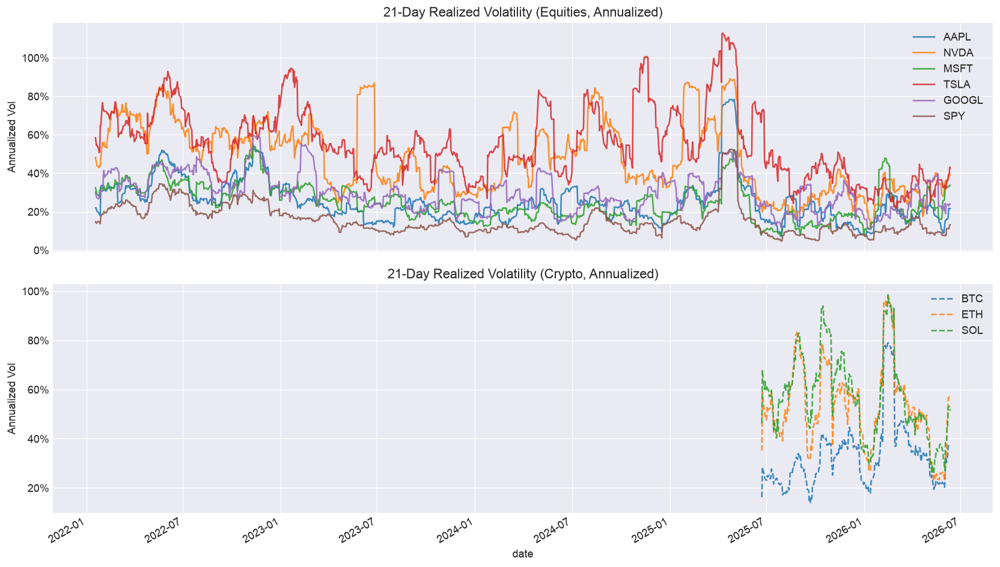

# quant-analytics


**Production-grade risk & factor analytics library** — built by Rosalina Torres as the quantitative backend to [ROSE ALPHA](https://rosalinatorres888.github.io/rose-alpha-dashboard), a live LLM-driven market intelligence dashboard.

Implements realized volatility, rolling correlation, drawdown analysis, and factor exposure (beta, growth/value tilt, HHI concentration) across an 11-asset universe: AAPL · NVDA · MSFT · TSLA · GOOGL · SPY · QQQ · VTI · BTC · ETH · SOL.

📓 **[View full analysis notebook →](https://nbviewer.org/github/rosalinatorres888/quant-analytics/blob/main/notebooks/risk_factor_analysis.ipynb)**



---

## Key Findings

| Metric | Finding |
|---|---|
| **Realized Volatility** | Crypto vol is 3–5× equity vol; TSLA is the highest-vol equity in the universe |
| **Vol Regime** | 21d/63d ratio > 1 for most assets — signals elevated short-term stress vs. quarterly baseline |
| **Correlation** | High avg pairwise correlation during risk-off events limits diversification benefit |
| **Max Drawdown** | Crypto: 70–85% peak-to-trough; equities: 30–65% |
| **Market Beta** | TSLA and NVDA are highest-beta equities (β > 1.5); crypto shows low equity beta |
| **Growth Tilt** | NVDA, AAPL, GOOGL co-move with growth; QQQ is growth-heavy by construction |
| **HHI** | Equal-weight 11-asset portfolio is well-diversified; tech overweight increases concentration |

---

## Structure

```
quant-analytics/
├── quant/
│   ├── data.py          # yfinance + CoinGecko fetching, CSV caching, calendar alignment
│   ├── volatility.py    # Realized vol (21d/63d annualized), VIX context, term structure
│   ├── correlation.py   # Rolling Pearson correlation matrix, avg pairwise corr
│   ├── drawdown.py      # Max drawdown, duration, underwater curves, portfolio drawdown
│   └── factors.py       # Beta to SPY (OLS), VUG/VTV tilt, HHI concentration
├── tests/               # pytest unit tests — all use synthetic data, no network calls
├── notebooks/
│   └── risk_factor_analysis.ipynb  # Narrative analysis with stated assumptions
├── data/cache/          # CSV price cache (gitignored — auto-created on first run)
└── requirements.txt
```

---

## Quickstart

**Requires Python ≥ 3.10** (uses PEP 604 union types).

```bash
pip install -r requirements.txt
jupyter notebook notebooks/risk_factor_analysis.ipynb
```

First run fetches prices from yfinance and CoinGecko and caches to `data/cache/`.
Subsequent runs load from cache. Delete a CSV to force a re-fetch.

```python
from quant.data import get_prices, align_returns, ALL_ASSETS
from quant.volatility import realized_vol
from quant.drawdown import max_drawdown, drawdown_table
from quant.factors import factor_exposures, hhi

prices = get_prices(start='2022-01-01')
returns = align_returns(prices)

# Annualized realized vol (21-day window)
vol = realized_vol(returns, window=21)

# Max drawdown per asset
dd = drawdown_table(prices)

# Market beta (OLS on SPY)
betas = factor_exposures(returns, returns['SPY'])
```

---

## Run Tests

```bash
pytest tests/ -v
```

All tests use synthetic data with known mathematical properties (e.g., constant returns → zero vol, diagonal correlation matrix → zero avg pairwise corr). No network calls required.

---

## Methodology

| Assumption | Choice | Rationale |
|---|---|---|
| Return type | Daily log returns: ln(P_t / P_{t-1}) | Additive over time, approximately normal — preferred for statistical analysis |
| Annualization | √252 (equity calendar anchor) | ~252 equity trading days/year; crypto weekend gaps forward-filled |
| Short vol window | 21 trading days | Standard 1-month realized vol lookback |
| Long vol window | 63 trading days | Standard 1-quarter baseline for vol regime detection |
| Correlation window | 63 trading days | Balances recency vs. noise |
| Beta estimation | OLS, full sample, no risk-free rate | Daily risk-free rate ≈ 0; acceptable approximation at daily frequency |
| Calendar alignment | Forward-fill crypto ≤5 days, anchor to SPY | Prevents artificial vol inflation from weekend crypto gaps |
| Missing data | Forward-fill ≤5 consecutive NaN; drop remaining | Handles holiday gaps without introducing stale prices beyond a week |

---

## Built With

`yfinance` · `pandas` · `NumPy` · `scikit-learn` · `matplotlib` · `seaborn` · `pytest` · `Jupyter`

---

## Related Projects

- **ROSE ALPHA** — live LLM-driven market intelligence dashboard ([live site](https://rosalinatorres888.github.io/rose-alpha-dashboard) · [repo](https://github.com/rosalinatorres888/rose-alpha-dashboard))
- **Career Intelligence System** — semantic job matching + resume generation ([repo](https://github.com/rosalinatorres888/career-intelligence-system))
- **ARIA** — autonomous 7-stage career intelligence pipeline ([repo](https://github.com/rosalinatorres888/aria-career-assistant))

---

**Author:** Rosalina Torres — MS Data Analytics Engineering @ Northeastern University
